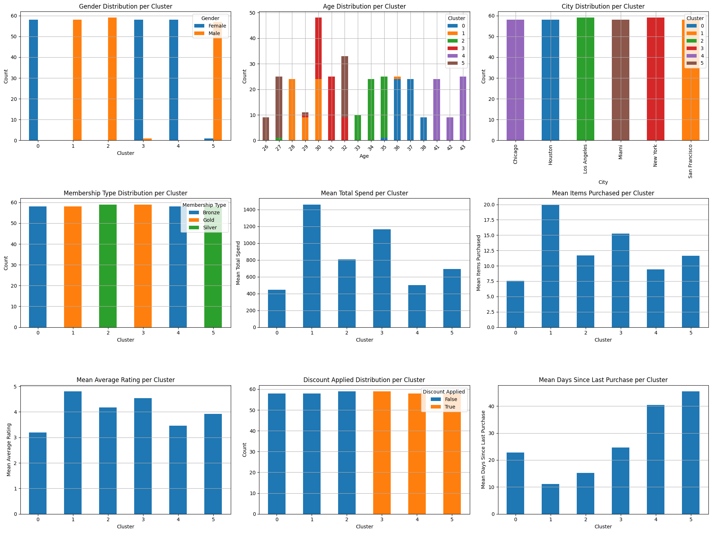

# understanding customer shopping behaviors using KMeans

## problem statement
In today's competitive business landscape, understanding customers is paramount for sustainable growth and effective marketing strategies. Businesses often struggle with a monolithic view of their customer base, leading to generic marketing campaigns that yield suboptimal results. Without segmenting customers, companies risk misallocating resources, failing to address specific customer needs, and missing opportunities for personalized engagement

## the objectives
1. Discover meaningful customer clusters
2. Validate cluster quality using silhouette score ≥ 0.80.
3. Generate actionable persona descriptions for each cluster.
4. Recommend marketing strategies tailored to each persona.

## datasource
https://www.kaggle.com/datasets/zeesolver/consumer-behavior-and-shopping-habits-dataset

## implementation steps
1. data exploration EDA
2. data preprocessing: encoding categorical data, scaling values, feature engeneering
3. determining optiman number of clusters  using elbow method
4. model training and clustering
5. model evaluation
6. understanding the different clusters

## results
to evaluate the maachine learning perfomance on the data, i used silhoutte score of 89% 

##  description of each cluster:
| Cluster | Age Range (Mode) | Gender Dominant | Membership | Spend Level | Purchase Freq | Rating | Discount Response | Recency (days) | Persona Description                      |
|--------:|------------------|------------------|-------------|--------------|----------------|--------|--------------------|----------------|-------------------------------------------|
|   0     | 29–31            | Female           | Bronze      | Medium       | Medium         | 3.5    | Low                | ~22 days       | Steady Shoppers – consistent mid-level buyers, not discount-driven |
|   1     | 27–29            | Male             | Gold        | **Highest**  | **Highest**    | **4.8**| Low                | **~10 days**   | Loyal Big Spenders – highly active, very satisfied customers |
|   2     | 31–33            | Male             | Silver      | Medium-High  | Medium         | 4.2    | Low                | ~15 days       | Positive Regulars – happy, regular buyers with moderate loyalty |
|   3     | 36–38            | Male             | Bronze      | Low          | Low            | 2.8    | **High**           | **~40+ days**  | At-Risk Bargain Seekers – less active, price-driven customers |
|   4     | 41–43            | Female           | Gold        | Low          | Low            | 3.2    | **High**           | **~45 days**   | Dormant Deal Hunters – inactive but respond to discounts |
|   5     | 39–41            | Female           | Silver      | Medium       | Medium-Low     | 3.8    | Low                | ~40+ days      | Passive Mid-Tier Shoppers – not very active, but not price-focused |

- **Cluster 0 – Steady Shoppers**  
  ➤ Maintain engagement with regular newsletters  
  ➤ Promote personalized product recommendations  
  ➤ Focus on brand experience (not discounts)

- **Cluster 1 – Loyal Big Spenders**  
  ➤ Offer exclusive VIP programs and early access  
  ➤ Prioritize retention through loyalty rewards  
  ➤ Solicit testimonials and referrals

- **Cluster 2 – Positive Regulars**  
  ➤ Send thank-you emails, occasional appreciation gifts  
  ➤ Recommend upsells and bundles  
  ➤ Encourage them to join loyalty tiers

- **Cluster 3 – At-Risk Bargain Seekers**  
  ➤ Re-engagement campaigns with time-limited discounts  
  ➤ Highlight value-for-money bundles  
  ➤ Use urgency-based messaging

- **Cluster 4 – Dormant Deal Hunters**  
  ➤ Win-back campaigns with personalized coupons  
  ➤ Retargeting via email and ads  
  ➤ Reactivation loyalty program for lapsed users

- **Cluster 5 – Passive Mid-Tier Shoppers**  
  ➤ Promote curated deals and seasonal events  
  ➤ Nudge them with wishlist reminders  
  ➤ Test onboarding surveys to re-personalize experience

  
